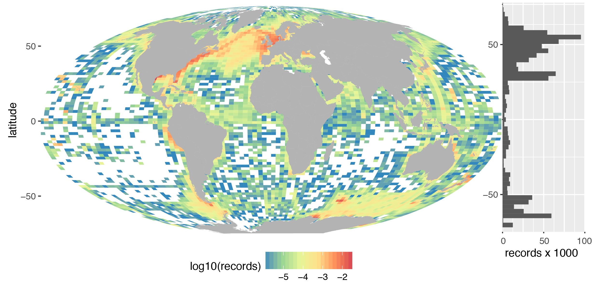
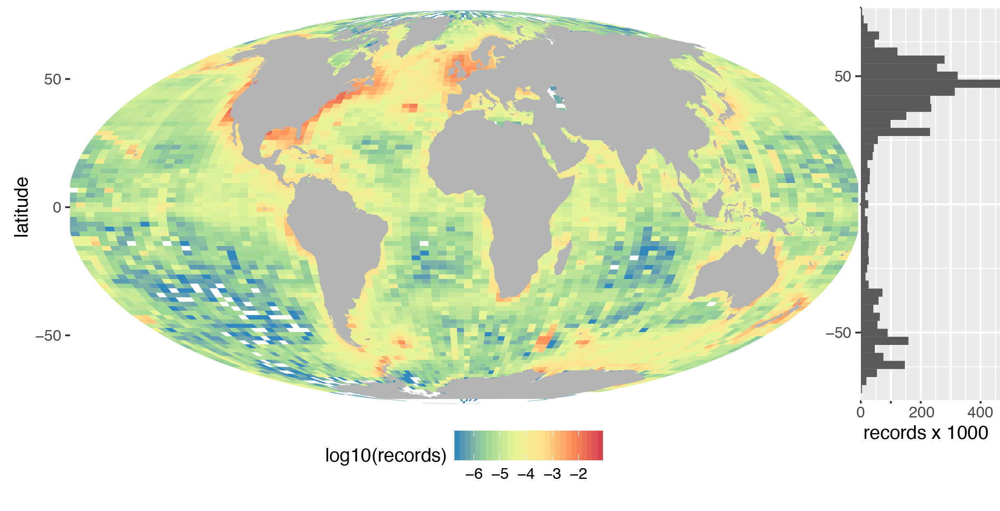

## load

```{r setup, include=FALSE, echo=F}
knitr::opts_chunk$set(echo=T, cache=T)
```

```{r load libraries & data}
# load libraries
suppressPackageStartupMessages({
  require(dplyr)
  require(ggplot2)
  library(rgdal)
  library(ncdf4)
  library(raster)
})

# load data provided by Peter Provoost (2016-10-03)
load('data/obis.dat')

# filter data to valid lon/lat and depth <= 20m
d = data %>%
  rename(lon = longitude, lat=latitude) %>%
  filter(
    !is.na(lon), !is.na(lon),
    !is.na(year),
    depth <= 20) %>%
  mutate(
    lon = ifelse(lon < -180, 360 + lon, lon),
    x = lon,
    y = lat)

# projections
crs_mol = '+proj=moll +lon_0=0 +x_0=0 +y_0=0 +ellps=WGS84 +units=m +no_defs'
crs_gcs = '+init=epsg:4326'

# project lonlat bins to mollweide for adding histogram to margin of map
pts_gcs = d
coordinates(pts_gcs) = ~x+y
proj4string(pts_gcs) = CRS(crs_gcs)
pts_mol = spTransform(
  pts_gcs,
  CRS(crs_mol))
xy_mol = coordinates(pts_mol) %>% as.data.frame()
```

## depth

### GEBCO

```{r gebco}
nc = 'data/GEBCO_2014_2D.nc'
depth = raster(nc, layer = 'elevation')

system.time({
  pts_depth_gcs = extract(
    depth, pts_gcs, method='simple', sp=T)})


depth_a = crop(depth, extent(-84,-83,21,22))
f_png = 'depth_a.png'
png(f_png)
plot(depth_a)
dev.off()
system(sprintf('open %s', f_png))

library(marmap) # readGEBCO.bathy

depth = readGEBCO.bathy(
  file=nc, resolution = 1)

raster(file="gebco_08_-82_37_63_80",varname="z")


summary(depth)
# Bathymetric data of class 'bathy', with 43200 rows and 21600 columns
# Latitudinal range: -90 to 90 (90 S to 90 N)
# Longitudinal range: -180 to 180 (180 W to 180 E)
# Cell size: 0.5 minute(s)
# Depth statistics:
#    Min. 1st Qu.  Median    Mean 3rd Qu.    Max.
#  -10980   -4286   -2462   -1891     215    8685
# custom col palette
blues = colorRampPalette(c("lightblue","cadetblue1","white"))

# create vectors of latitude and longitude to define the boundary of a polygon
# cuba: c(-84.0376675, 21.5013198)
xy <- tibble::tribble(
  ~lon, ~lat,
  -84, 21,
  -84, 23,
  -83, 23,
  -83, 21)

saveRDS(depth, 'data/depth_gebco2014.rds')


depth = readRDS('data/depth_gebco2014.rds')
depth_r = marmap::as.raster(depth)
saveRDS(depth_r, 'data/depth_gebco2014_raster.rds')
#depth_r = readRDS('data/depth_gebco2014_raster.rds')
depth_a = raster::crop(
  depth_r, extent(-84,-83,21,22))
plot(depth_a)

plot(xy$lon,xy$lat)
# Use of subsetBathy to extract the new bathy object
depth_a <- subsetBathy(
  depth, x=c(-84,-83), y=c(21,22), locator=FALSE)


plot(med, n=1, im=T, bpal=blues(100)) # bathymetry

  as.numeric(rownames(sid)) -> x.sid
  as.numeric(colnames(sid)) -> y.sid
  contour(x.sid, y.sid, sid, drawlabels=FALSE, lwd=.1, add=TRUE) # SID


```


## hist_depth_gcs

Summarize records by 5 decimal degrees and generate histogram with x-axis aligned in geographic coordinate system (**gcs**).

```{r hist_depth_gcs}
# summarize data by 5 deg bins and depth
d_sum <- data %>%
  filter(
    latitude <= 90 | latitude >= -90,
    !is.na(depth)) %>%
  mutate(
    zone = cut(depth, c(0, 20, 200, Inf), labels=c('< 20', '20 - 200', '> 200')),
    band = round(latitude / 5) * 5) %>%
  group_by(band, zone) %>%
  summarize(
    records = n())

# histogram of depth by latitude
ggplot(d_sum, aes(x = band, y = records, fill = zone)) +
  geom_bar(stat = 'identity') +
  scale_fill_brewer(palette='YlGnBu', name='zone (m)') +
  scale_y_continuous(expand = c(0, 0)) +
  labs(x='latitude')
```


## map_lt20m_mol

Summarize records using [`ggplot2::geom_bin2d()`](https://www.rdocumentation.org/packages/ggplot2/versions/2.1.0/topics/geom_bin2d) filtered by all records less than or equal to 20 m depth (**lt20m**) with `100` bins and `log10` scale to show variation and project to Mollweide (**mol**) for more area-realistic map.

### get land

Using [Land - 1:10m Physical Vectors | Natural Earth](http://www.naturalearthdata.com/downloads/10m-physical-vectors/10m-land/), (3.26 MB) version 3.0.1.

> Derived from 10m coastline. Continental polygons broken into smaller, contiguous pieces to avoid having too many points in any one polygon, facilitating faster data processing in certain software applications. _(below) Yucatan peninsula, Cuba, and Hispaniola._


```{r get land, eval=F}
land_rdata = 'data/land.Rdata'

if (!file.exists(land_rdata)){

  # download land from NE (Natural Earth)
  land_zip_url = 'http://www.naturalearthdata.com/http//www.naturalearthdata.com/download/10m/physical/ne_10m_land.zip'
  land_zip = tempfile(fileext='.zip')
  land_dir = tempdir()
  download.file(land_zip_url, land_zip)
  unzip(land_zip, exdir=land_dir)

  # read in as SpatialPolygonsDataFrame
  land     = readOGR(dsn=land_dir, layer='ne_10m_land')

  # project to Mollweide
  land_mol = spTransform(land, CRS(crs_mol))

  # save
  save(land, land_mol, file=land_rdata)
} else {
  load(land_rdata)
}
```

### get land buffer

```{r land buffer, eval=F}
library(rgeos)

land_buf_rdata = 'data/land_buf.Rdata'

if (!file.exists(land_buf_rdata)){
  system.time({
    land_buf100km = gBuffer(land_mol, width=100000)}) # 1848.148 seconds = 30.8 minutes
  save(land_buf100km, file=land_buf_rdata)
} else {
  load(land_buf_rdata)
}
```


### rasterize obis

```{r rasterize obis}
# setup reference raster for global 1 deg cells
r = raster(extent(-180, 180, -90, 90), ncols=360, nrows=180, crs=crs_gcs)

# calculate number of records per reference 1 deg raster
r_n = rasterize(pts_gcs, r, 'records', fun=sum) # plot(r_n)

# calculate area
r_km2   = area(r)                         # plot(r_km2)

# calculate density: number of records per km2
r_n_km2 = r_n / r_km2                     # plot(r_n_km2)

# get max value for plotting time-series
max_i  = which.max(r_n_km2)
max_pt = xyFromCell(r_n_km2, max_i)
max_v  = r_n_km2[max_i] # 90.86918

plot(r_n_km2)
# other:
#   getValues(r, row) by row
#   extract
```
The max value `r max_v` is found at `r as.character(max_pt)`.

### map mollweide

```{r map_mol}
n_bins = 100
world = map_data('world')

# TODO:
# - calculate # of records per 1x1 deg cell in a raster [rasterize(pts, fun='count')]
# - calculate area per cell [raster::area]
# - divide to get density of pts / km^2
# - add border around globe

library(rasterVis) # gplot

d=data.frame(x1=c(1,3,1,5,4), x2=c(2,4,3,6,6), y1=c(1,1,4,1,3), y2=c(2,2,5,3,5), t=c('a','a','a','b','b'), r=c(1,2,3,4,5))
ggplot() +
scale_x_continuous(name="x") +
scale_y_continuous(name="y") +
geom_rect(data=d, mapping=aes(xmin=x1, xmax=x2, ymin=y1, ymax=y2, fill=t), color="black", alpha=0.5)


f_pdf = 'fig/map_obis-records_2.pdf'
m = rasterVis::gplot(r_n_km2) +
  geom_rect(
    aes(xmin=x_min, xmax=x_max, ymin=y_min, ymax=y_max),
    data=data.frame(x_min=-180, x_max=180, y_min=-90, y_max=90),
    colour='black', fill='white', size=0.3, inherit.aes=F) +
  geom_tile(aes(fill=value), colour = NA)  +
  scale_fill_distiller(
    type='div', palette='Spectral',
    name=expression(# / km^2), na.value='white') +
  geom_map(data=world, map=world, aes(x=long, y=lat, map_id=region), fill = 'grey70') +
  coord_map("mollweide", xlim=c(-180, 180)) +
  ylab('latitude') +
  theme(
    panel.background=element_blank(),
    axis.text.x=element_blank(), axis.ticks.x=element_blank(), # x ticks
    axis.title.x=element_blank(),                              # x title
    panel.border=element_blank(),                              # panel
    legend.position='bottom')

pdf(f_pdf)
print(m)
invisible(dev.off())
system(sprintf('open %s', f_pdf))

m = ggplot() +
ggplot() +
  #geom_bin2d(
  #  aes(x=lon, y=lat, fill=log10(..density..)), data = d, bins=n_bins) +
  #scale_fill_distiller(type='div', palette='Spectral', name='log10(records)') +
  geom_map(
    data=world, map=world, aes(x=long, y=lat, map_id=region), fill = 'grey70') +
  coord_map("mollweide", xlim=c(-180, 180)) +
  ylab('latitude') +
  theme(
    panel.background=element_blank(),
    axis.text.x=element_blank(), axis.ticks.x=element_blank(), # x ticks
    axis.title.x=element_blank(),                              # x title
    panel.border=element_blank(),                              # panel
    legend.position='bottom')

# save plot
pdf('fig/map_obis-records.pdf')
print(m)
invisible(dev.off())

# output
m
```

## hist_lt20m_mol

Histogram of records using the same vertical axes as the Mollweide map for manually aligning after.

```{r hist_mol, message=F}
# interpolate latidude in decimal degrees to Mollweide (m)
y_brks = approx(
  d_gcs@data$lat, xy$y,
  c(-90, -50, 0, 50, 90))

# plot histogram of records by latitude
h = ggplot(xy_mol, aes(x=y)) +
  geom_histogram(aes(y = ..count../1000), bins=50) +
  scale_x_continuous(
    name = 'latitude',
    breaks = y_brks$y,
    labels = y_brks$x,
    expand = c(0,0)) +
  scale_y_continuous(
    limits = c(0,100),
    expand = c(0,0)) +
  labs(x=NULL, y='records x 1000') +
  coord_flip()

# save plot
pdf('fig/hist_obis-records.pdf')
print(h)
invisible(dev.off())

# output
h
```

## map_hist_lt20m_mol

Manually combined the map and histogram in Adobe Illustrator from the pdf outputs: [map_hist_obis-records.pdf](fig/map_hist_obis-records.pdf) + [hist_obis-records.pdf](fig/hist_obis-records.pdf) -> [map_hist_obis-records.pdf](fig/map_hist_obis-records.pdf).




## old: map_hist_mol

For comparison, here's the manually combined map and histogram for all depths (ie not filtered by <= 20m): [map_hist_obis-records_alldepths.pdf](fig/map_hist_obis-records_alldepths.pdf).




```{r old unused, eval=F, echo=F}
# ggmap
library(ggmap)
omap <- get_map(
  location = c(lon=0,lat=0), zoom=3,
  source = 'stamen', maptype = 'toner-lite')
ggmap(omap) +
  stat_density2d(
    aes(x = longitude, y = latitude),
    size = 2, bins = 4, data = data, geom = "polygon")


# MASS::kde2d() ----

library(MASS)

# Default call
k <- with(
  data,
  kde2d(longitude,latitude))
image(k, col=r)

# kernel density estimation
k <- kde2d(data$longitude, data$latitude, n=200)
pal = colorRampPalette(rev(brewer.pal(11,'Spectral')))
image(k, col=pal(32))


# margins
oldpar <- par()
par(mar=c(3,3,1,1))
layout(matrix(c(2,0,1,3),2,2,byrow=T),c(3,1), c(1,3))
image(k, col=r) #plot the image
par(mar=c(0,2,1,0))
barplot(h1$counts, axes=F, ylim=c(0, top), space=0, col='red')
par(mar=c(2,0,0.5,1))
barplot(h2$counts, axes=F, xlim=c(0, top), space=0, col='red', horiz=T)
```
